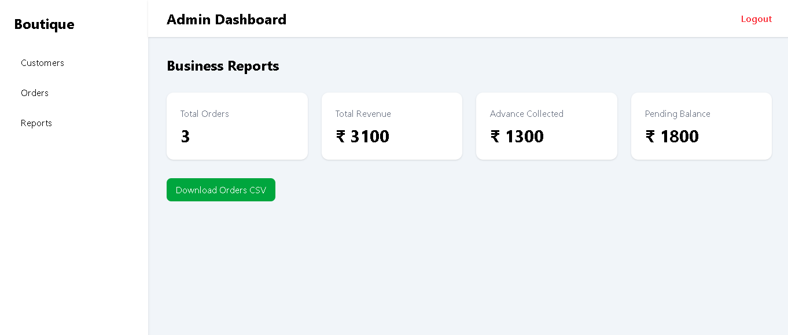

# Boutique Management System (Full Stack SaaS)

A full-stack web application built to digitize a real boutique business workflow.

This app replaces the traditional notebook system used by tailoring shops to manage customers, orders, delivery dates and payments.

LIVE DEMO  
Frontend: https://boutique-frontend-u5zy.onrender.com  
Backend API: https://boutique-api-0sog.onrender.com

---

## Screenshots

### Login Page

### Customers Management

### Orders Workflow

### Reports & Analytics

---

## Problem

Small tailoring shops still manage orders using notebooks and memory.
This causes:

- Lost measurements
- Forgotten delivery dates
- No business insights
- Manual tracking of payments

This project solves that by providing a cloud-based admin dashboard.

---

## Features

Authentication

- Secure login/logout
- Token based session management

Customer Management

- Add & search customers
- Store contact details & measurements

Order Management

- Create stitching orders
- Track delivery status
- Payment tracking (advance + balance)
- Mark orders delivered

Reports Dashboard

- Revenue analytics
- Pending balance tracking
- CSV export for accounting

User Experience

- Toast notifications
- Form validation
- Search & filtering
- Loading states

---

## Project Highlights

- Built for a real boutique business workflow
- Full CRUD + authentication + reports
- Migrated from SQLite → PostgreSQL (cloud)
- Deployed full stack on Render
- Production-ready environment configuration

---

## Tech Stack

Frontend

- React (Vite)
- Tailwind CSS
- React Hot Toast

Backend

- Python Flask REST API
- JWT-like token auth

Database

- PostgreSQL (Render Cloud)

Deployment

- Render (Backend + Frontend)

## Render Configuration

Frontend Render service

- Set `VITE_API_URL=https://boutique-api-0sog.onrender.com`
- Do not point `VITE_API_URL` to the frontend URL, or the app will receive the SPA HTML instead of API JSON.

Backend Render service

- Set `DATABASE_URL` to the Render PostgreSQL connection string.
- Set `CORS_ORIGINS` to include the frontend URL, for example `https://boutique-frontend-u5zy.onrender.com`.

Local development

- Do not set `DATABASE_URL` locally unless you want to use Postgres.
- Local development continues to use SQLite through `SQLITE_DB_PATH` with the default `boutique.db`.

---

## Architecture

React Frontend → Flask API → PostgreSQL Database

---

## Future Roadmap

- Customer mobile app
- WhatsApp delivery reminders
- AI-based pricing suggestions
- Multi-boutique SaaS version

---

## Why this project matters

This app was built for a real family boutique business.
It demonstrates full-stack development, deployment, database migration and real-world problem solving.
