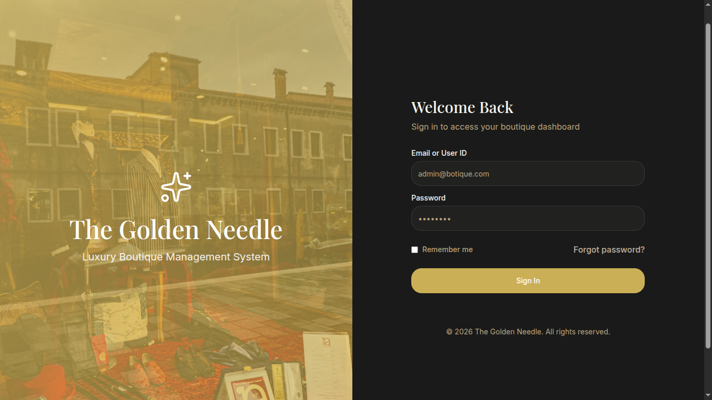
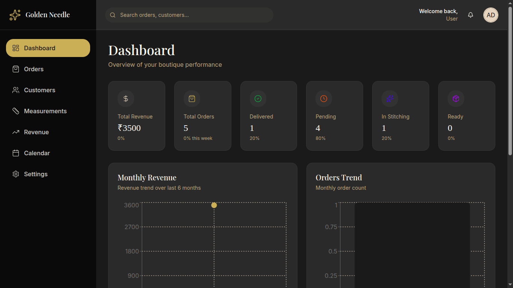
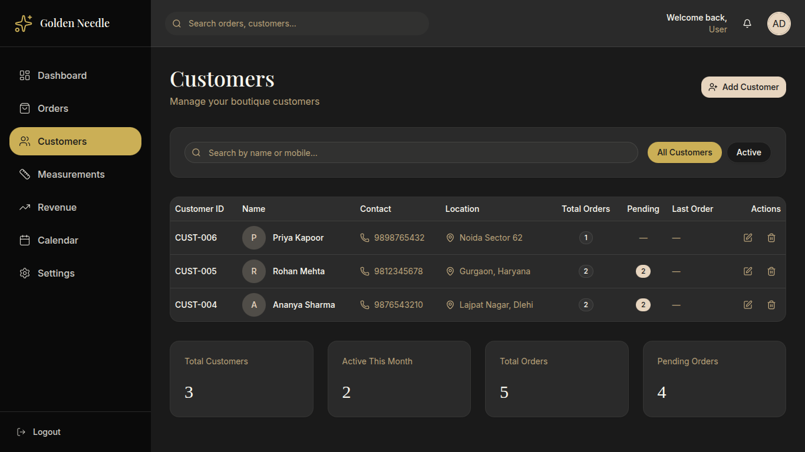
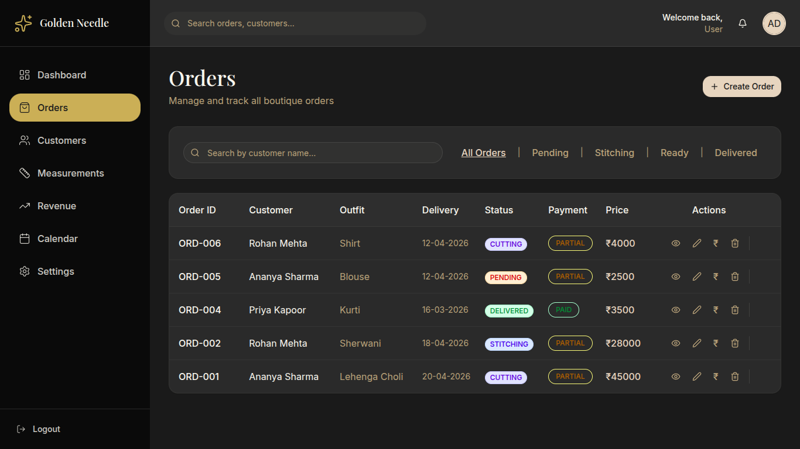
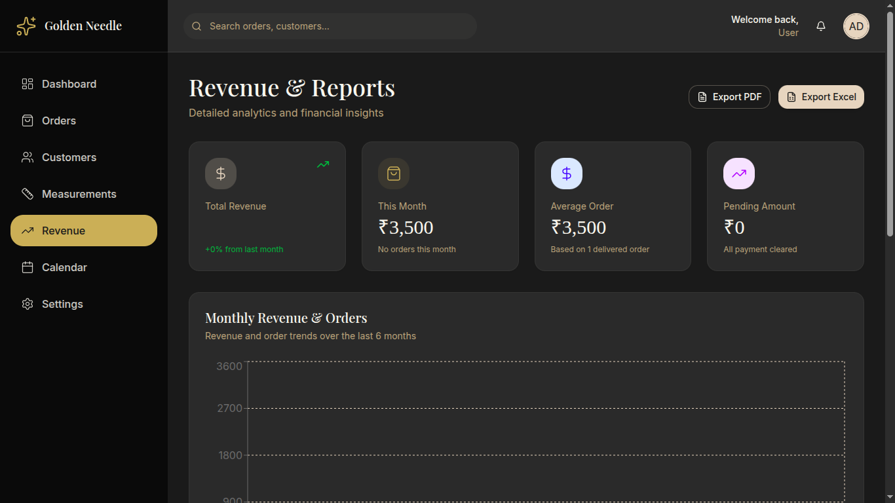

# 🧵 Boutique Management System (Full Stack SaaS)


---

## 📌 Overview

The **Boutique Management System ** is a full-stack SaaS dashboard built to digitize and optimize boutique operations.

It transforms traditional manual workflows into a **modern, scalable, and data-driven system** with multiple dedicated modules.

---

## 🌐 LIVE DEMO

- 🔗 **Frontend:**
  https://boutique-frontend-u5zy.onrender.com
- 🔗 **Backend API:**
  https://boutique-api-0sog.onrender.com

---

## 🔐 Demo Login (Admin Access)

Use the credentials to explore the dashboard:

- **Username:** `admin`
- **Password:** `admin123`

  > ⚠️ Note: Signup functionality is not available. This is a demo admin account.

---

## 📸 Screenshots











---

## 🎯 Problem Statement

Small tailoring shops still rely on notebooks and tracking.

This leads to:

- ❌ Lost measurements
- ❌ Missed delivery dates
- ❌ No business insights
- ❌ Manual tracking of payments

---

## ✅ Solution

This project provides a **cloud-based admin dashboard** to manage all boutique operations efficiently.

---

## 🧩 Core Modules

### 📊 Dashboard

- Overview of total orders, revenue, and pending work
- Quick insights & stats

### 📦 Orders

- Create stitching orders
- Track status (pending / completed)
- Assign delivery dates

### 👥 Customers

- Add, edit, search customers
- Store contact details

### 📏 Measurements

- Save detailed body measurements
- Link measurements to customers

### 💰 Revenue

- Track income & pending payments
- Financial insights dashboard

### 📅 Calendar

- Visual tracking of delivery schedules
- Avoid missed deadlines

### ⚙️ Settings

- Manage system configurations
- Future scope for user roles

---

## ✨ Features

### 🔐 Authentication

- 🔐 Secure authentication system
- 📊 Real-time analytics dashboard
- 🔍 Advanced search & filtering
- ⚡ Fast and responsive UI
- 🧾 Order + payment tracking
- 📅 Delivery scheduling system
- 📈 Revenue insights

---

## 🚀 Project Highlights

- 🧵 Built for a real boutique workflow
- 📦 Modular dashboard architecture
- 🔐 Full CRUD + authentication + reports
- 🗄 Migrated SQLite → PostgreSQL (cloud)
- 🌐 Fully Deployed (Frontend + Backend)

---

## 🛠 Tech Stack

### 🎨 Frontend

- React (Vite)
- Tailwind CSS
- React Hot Toast

### ⚙️ Backend

- Python Flask REST API
- Token-based Authentication

### 🗄 Database

- PostgreSQL

### 🚀 Deployment

- Render

---

## ⚙️ Installation

### 1️⃣ Clone Repository

```bash
git clone https://github.com/kannishhh/boutique-management.git
cd boutique-management
```

### 2️⃣ Frontend Setup

```bash
cd frontend
npm install
npm start
```

### 3️⃣ Backend Setup

```bash
cd backend
pip install -r requirements.txt
python app.py
```

---

## 🔐 Environment Variables

### ⚙️ Backend `.env` file:

```
DATABASE_URL=your_postgresql_url
SECRET_KEY=your_secret_key
```

### 🎨 Frontend `.env` file:

```
VITE_API_URL=https://boutique-api-0sog.onrender.com
```

---

## 🏗 Architecture

React Frontend → Flask API → PostgreSQL Database

---

## 🚀 Future Roadmap

- 📱 Mobile app for customers
- 📲 WhatsApp delivery reminders
- 🤖 AI-based pricing suggestions
- 🏢 Multi-user roles (Admin/Staff)
- 📊 Advanced analytics & reports

---

## 💡 Why this project matters

This project was built for a real family boutique business.

It demonstrates:

- Full-stack development
- SaaS dashboard design
- Real-world problem solving
- Production deployment`
- Scalable architecture

---

## 👨‍💻 Author

**Kanish Kainth**
🔗 https://github.com/kannishhh
